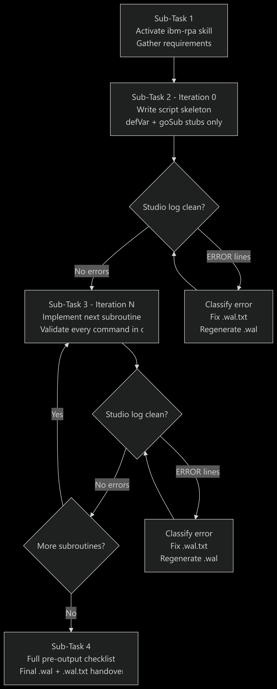

# IBM RPA Bot Generator

A workspace for generating IBM RPA WAL bot scripts iteratively using the
**RPA Bot Generator** Bob mode. Scripts are built one subroutine at a time,
validated against the command knowledge base on every iteration, and confirmed
clean in IBM RPA Studio before the next subroutine is started.

---

## Quick Start

1. Switch to the **RPA Bot Generator** mode in the Bob mode picker.
2. Describe the bot you want to build (automation target, inputs, outputs).
3. Bob will walk you through the full iterative workflow automatically.

---

## How It Works

The iterative workflow has four phases:

```
┌─────────────────────────────────────────────────────────────────┐
│  ITERATION N                                                     │
│                                                                  │
│  1. Determine next subroutine to implement                       │
│  2. Validate every command against commands_kb.md                │
│  3. Write / patch .wal.txt (plain UTF-8 source)                  │
│  4. Run wal_generator.py  → binary .wal                          │
│  5. User opens .wal in IBM RPA Studio                            │
│  6. Bob reads Studio log  (MCP tool)                             │
│  7a. Errors found  → diagnose → fix .wal.txt → back to step 4   │
│  7b. Log clean     → confirm → advance to next subroutine        │
└─────────────────────────────────────────────────────────────────┘
```



| Phase | What happens |
|---|---|
| **0 — Skeleton** | All `defVar` declarations + stub `beginSub`/`endSub` blocks with only entry/exit log messages. Must open in Studio cleanly before any logic is added. |
| **N — Subroutine** | One subroutine body filled in per iteration. Commands are looked up in `commands_kb.md` before being written. Binary `.wal` is regenerated and Studio log is checked. |
| **Fix loop** | If Studio reports errors, Bob classifies the error, applies the minimal fix, regenerates, and re-reads the log. After 3 failed attempts on the same subroutine, Bob pauses and asks the user to paste the relevant log lines. |
| **Final** | Full pre-output checklist pass over the complete script. Both `.wal.txt` (editable source) and `.wal` (Studio-ready binary) are delivered. |

---

## Project Structure

```
.
├── iterative-bot-generation-plan.md   # Workflow definition and sub-task tracker
├── .bob/
│   ├── custom_modes.yaml              # RPA Bot Generator mode definition
│   └── skills/ibm-rpa/
│       ├── SKILL.md                   # Master WAL rules, checklist, error-fixing protocol
│       ├── commands_kb.md             # Authoritative command reference (27 categories)
│       ├── wal-reference.md           # Condensed quick-reference
│       ├── conventions.md             # Naming and structure conventions
│       └── examples/                  # Working WAL script examples
├── template/
│   └── template.wal                   # Protobuf binary template for wal_generator.py
├── tools/
│   └── wal_generator.py               # Converts .wal.txt source → Studio-openable binary .wal
├── samples/                           # Sample bot scripts
├── knowledge_base/                    # Domain research and reference material
└── skill_readme.md                    # Guide for generating PPT decks from the ibm-rpa skill
```

---

## The RPA Bot Generator Mode

Defined in [`.bob/custom_modes.yaml`](.bob/custom_modes.yaml).

| Property | Value |
|---|---|
| Slug | `rpa-bot-generator` |
| Display name | **RPA Bot Generator** |
| Tool groups | `read`, `edit`, `execute`, `mcp`, `skill`, `todo` |

### What the mode enforces

- Activates the `ibm-rpa` skill (loads `SKILL.md`) at the start of every session.
- Reads `commands_kb.md` and `wal-reference.md` into context before writing any code.
- Reads `iterative-bot-generation-plan.md` to resume from the last completed sub-task.
- Implements **exactly one subroutine per iteration** — never more.
- Validates every command against `commands_kb.md` before writing it.
- Runs `wal_generator.py` after every change to `.wal.txt`.
- Reads the Studio log via the MCP tool after every Studio open.
- Escalates to the user after **3 consecutive failed fix attempts** on the same subroutine.
- Never advances to the next subroutine until the current one is log-clean.
- Updates sub-task statuses in `iterative-bot-generation-plan.md` as work progresses.

---

## Iterative Bot Generation Plan

[`iterative-bot-generation-plan.md`](iterative-bot-generation-plan.md) tracks progress and
defines the four sub-tasks that make up every bot generation session.

| Sub-Task | Intent |
|---|---|
| **1 — Activate skill and establish context** | Load `SKILL.md`, `commands_kb.md`, `wal-reference.md`; gather automation requirements from the user. |
| **2 — Design skeleton (Iteration 0)** | Write all `defVar` lines + stub subroutines; confirm Studio parses the file cleanly before any logic is added. |
| **3 — Implement subroutines (one per iteration)** | Fill in one subroutine body per iteration: validate → write → regenerate → Studio open → check log → fix or advance. |
| **4 — Final validation and handover** | Full pre-output checklist pass; deliver `.wal.txt` + `.wal`; document assumptions and limitations. |

---

## Key Tools

### `wal_generator.py`

Converts a plain-text `.wal.txt` source file into a Studio-openable binary `.wal`
by wrapping it with the correct protobuf framing from `template/template.wal`.

```powershell
py tools/wal_generator.py --template template/template.wal `
   --script my_bot.wal.txt --output my_bot.wal
```

> **Why this is needed:** `.wal` files are protobuf binary files. A plain text file
> saved with a `.wal` extension will always fail to open in Studio with
> `ProtoBuf.ProtoException: Invalid wire-type`. The generator recalculates the
> length varint so Studio can parse the file correctly.

### Studio Log MCP Tool

The `mcp__rpa-studio-log__read_studio_log` MCP tool reads the tail of the Studio
log and highlights any `ERROR`, `Exception`, `ParseException`, or `ProtoException`
lines. Bob calls this automatically after every Studio open — you do not need to
read the log manually unless the 3-attempt escalation is triggered.

Log location (read manually if needed):
```
C:\Users\Administrator\AppData\Local\IBM Robotic Process Automation\Studio.log
```

> **Known noise:** A `WARN ... Variable.Parse(null)` entry appears on every script
> parse in Studio 30.x regardless of script content. This is a Studio bug — ignore
> it when no `ERROR` lines are present.

---

## File Handling Rules

| Rule | Detail |
|---|---|
| Source always in `.wal.txt` | Plain UTF-8, no BOM. This is the file you edit. |
| Binary always from generator | Run `wal_generator.py` after every `.wal.txt` change. Never write a `.wal` directly. |
| Edit with `apply_diff` / `search_and_replace` | Never use `write_file` on an existing `.wal`. Only the `.wal.txt` is text-edited; the binary is always regenerated from it. |
| No hardcoded credentials | Credentials come from `getAsset` (IBM RPA Vault) or process variables only. |

---

## Command Validation Rules

Before any WAL command is written to a script:

1. Look up the exact **action name** in [`commands_kb.md`](.bob/skills/ibm-rpa/commands_kb.md).
2. Verify the exact **parameter names** and **output variable name** (`var=value` suffix).
3. If the command is not listed in `commands_kb.md` — do not use it. Find the valid alternative.

Commands confirmed invalid in Studio 30.x (do not use):

| Invalid | Use instead |
|---|---|
| `throwException` | `throwError --message "..."` |
| `getProcessVariable` | Not supported — use `getAsset` or `setVar` defaults |
| `bindProcessVariables` with `${var}` in mappings | Remove; pass values via parent script or `setVar` |
| Quoted booleans e.g. `--readOnly "true"` | Unquoted: `--readOnly true` |
| `setVar` for arithmetic | `evaluate --expression "..." var=value` |

---

## IBM RPA Skill Reference

| File | Purpose |
|---|---|
| [`.bob/skills/ibm-rpa/SKILL.md`](.bob/skills/ibm-rpa/SKILL.md) | Master rule set — WAL essentials, script structure, checklist, error-fixing protocol |
| [`.bob/skills/ibm-rpa/commands_kb.md`](.bob/skills/ibm-rpa/commands_kb.md) | Authoritative command reference — 27 categories, exact parameter names, output variable names |
| [`.bob/skills/ibm-rpa/wal-reference.md`](.bob/skills/ibm-rpa/wal-reference.md) | Condensed quick-reference for fast lookup during code generation |
| [`.bob/skills/ibm-rpa/conventions.md`](.bob/skills/ibm-rpa/conventions.md) | Naming conventions, subroutine patterns, security rules, BAW integration |
| [`.bob/skills/ibm-rpa/examples/`](.bob/skills/ibm-rpa/examples/) | Working WAL script examples (web login, Excel reader, queue processor, Python bridge) |

---

## Related Documentation

| File | Content |
|---|---|
| [`skill_readme.md`](skill_readme.md) | Guide for generating PowerPoint decks from the ibm-rpa skill |
