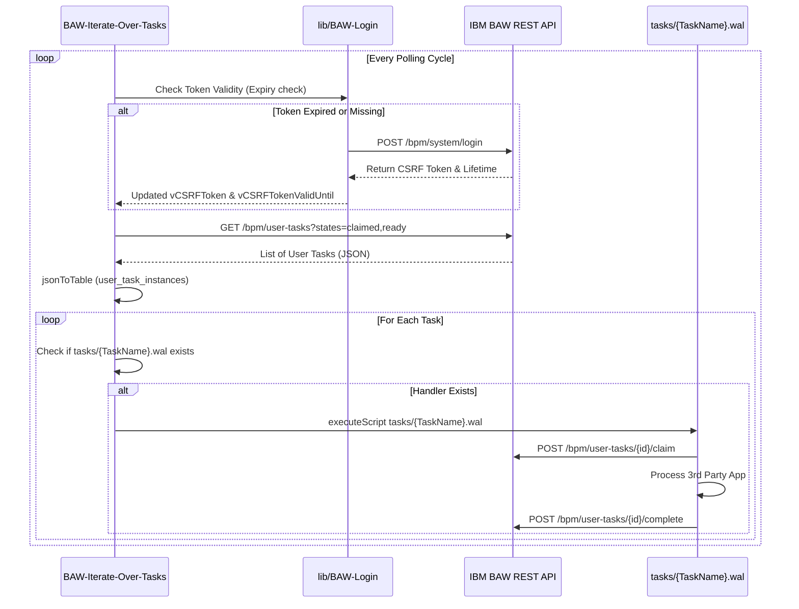
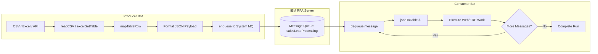

# IBM RPA Solutions Knowledge Base (`rpa_solutions_kb.md`)

This knowledge base synthesizes architecture patterns, integration blueprints, command recipes, and production lessons extracted from the completed IBM Robotic Process Automation (`.wal`) solutions across the `rpa_labs` repository.

Use this guide as an authoritative blueprint repository when generating, structuring, refactoring, and orchestrating IBM RPA WAL bots.

---

## Table of Contents

1. [Executive Summary & Architecture Taxonomy](#1-executive-summary--architecture-taxonomy)
2. [Catalog of Completed Lab Solutions](#2-catalog-of-completed-lab-solutions)
3. [End-to-End Solution Blueprints & Code Patterns](#3-end-to-end-solution-blueprints--code-patterns)
   - [Blueprint 1: Web Data Entry & CSV Ingestion (Lab 1)](#blueprint-1-web-data-entry--csv-ingestion)
   - [Blueprint 2: Business Automation Workflow (BAW) Synchronous REST Integration (Lab 2 & 10)](#blueprint-2-business-automation-workflow-baw-synchronous-rest-integration)
   - [Blueprint 3: Advanced Modular BAW Framework (Token Lifecycle & Task Looping) (Lab 2a)](#blueprint-3-advanced-modular-baw-framework-token-lifecycle--task-looping)
   - [Blueprint 4: Email Trigger & Automated Ingestion with Auto-Reply (Lab 3)](#blueprint-4-email-trigger--automated-ingestion-with-auto-reply)
   - [Blueprint 5: External Decision Service / ODM RuleApp Integration (Lab 4)](#blueprint-5-external-decision-service--odm-ruleapp-integration)
   - [Blueprint 6: Multi-App Desktop & Java Swing Hybrid Automation (Lab 5 & 7)](#blueprint-6-multi-app-desktop--java-swing-hybrid-automation)
   - [Blueprint 7: Asynchronous Enterprise Queue Processing (Enqueue / Dequeue) (Lab 8 & 11)](#blueprint-7-asynchronous-enterprise-queue-processing-enqueue--dequeue)
   - [Blueprint 8: Surface Automation & Remote Desktop via Vision Driver (Lab 9)](#blueprint-8-surface-automation--remote-desktop-via-vision-driver)
   - [Blueprint 9: Conversational AI & Dynamic Data Lookup Chatbot (Lab 12)](#blueprint-9-conversational-ai--dynamic-data-lookup-chatbot)
   - [Blueprint 10: SAP GUI VA01 Sales Order Entry with OCR Extraction (Lab 13)](#blueprint-10-sap-gui-va01-sales-order-entry-with-ocr-extraction)
   - [Blueprint 11: Mainframe 3270 / CICS Automation (Lab 15)](#blueprint-11-mainframe-3270--cics-automation)
   - [Blueprint 12: IBM i / AS400 5250 Terminal & PCOMM SQL Automation (Lab 20)](#blueprint-12-ibm-i--as400-5250-terminal--pcomm-sql-automation)
4. [Cross-Domain Recipe Matrix & Implementation Patterns](#4-cross-domain-recipe-matrix--implementation-patterns)
5. [Bot Generator Best Practices & Studio 30.x Compliance Checklist](#5-bot-generator-best-practices--studio-30x-compliance-checklist)

---

## 1. Executive Summary & Architecture Taxonomy

IBM RPA solutions span multiple interaction paradigms:

```
                          ┌────────────────────────────────────────┐
                          │         Trigger / Orchestration        │
                          │ (Scheduler, MQ, BAW REST, Email, Chat) │
                          └───────────────────┬────────────────────┘
                                              │
                    ┌─────────────────────────┴─────────────────────────┐
                    ▼                                                   ▼
         ┌─────────────────────┐                             ┌─────────────────────┐
         │ Synchronous Inbound │                             │ Asynchronous Queue  │
         │ (REST/Process API)  │                             │ (System MQ / SQS)   │
         └──────────┬──────────┘                             └──────────┬──────────┘
                    │                                                   │
        ┌───────────┴───────────────────────────────────────────────────┴───────────┐
        ▼                                   ▼                                       ▼
┌───────────────┐                  ┌─────────────────┐                     ┌─────────────────┐
│ Web & Cloud   │                  │ Thick Desktop   │                     │ Terminal Legacy │
│ • Chrome/Edge │                  │ • Java Swing    │                     │ • 3270 (CICS)   │
│ • ODM REST    │                  │ • WinForms/WPF  │                     │ • 5250 (iSeries)│
│ • BAW REST    │                  │ • SAP GUI       │                     │ • PCOMM         │
│ • SaaS Portal │                  │ • Vision/OCR    │                     │ • Screen Scrape │
└───────────────┘                  └─────────────────┘                     └─────────────────┘
```

### Core Architecture Classification
1. **Direct Web/Desktop Form Fillers**: Read tabular data (CSV/Excel) and drive Web DOM or Windows/Java controls.
2. **REST & Microservice Orchestrators**: Authenticate with OAuth/Basic Auth + CSRF, format JSON, trigger processes (BAW, ODM).
3. **Queue-Based Producer/Consumer**: Decouple ingestion (Enqueue CSV/Email into System MQ) from execution (Dequeue worker bot).
4. **Legacy & Enterprise ERP**: Drive low-level protocol screens (3270/5250 terminals) and SAP GUI transaction codes (VA01).
5. **Surface / Vision Automation**: Target remote desktop (Citrix/RDP) or non-accessible canvases via image search and OCR.
6. **Conversational Bots**: Chatbot endpoints handling NLP intent matching, KB queries, and live backend lookups.

---

## 2. Catalog of Completed Lab Solutions

| Lab Subfolder | Completed Script Name(s) | Primary Technology / Target | Key Architectural Capabilities Demonstrated |
|---|---|---|---|
| `Lab 1` | `sales-lead-automation-completed.wal` | Web (Chrome) + CSV | `readCSV`, `mapTableRow`, `while` loop, Web navigation, `--simulatehuman` typing, subroutines. |
| `Lab 2` | `BAWCallSwaggerViaREST.wal`, `sales-lead-automation-process-completed.wal` | Web + IBM BAW (REST API) | Modular bot execution (`executeScript`), Basic Auth + Base64 encoding, CSRF token retrieval from `/bpm/system/login`, process kickoff via POST. |
| `Lab 2a` | `BAW-Iterate-Over-Tasks.wal`, `BAW-Login.wal`, `BAW-Build-Data-JSON.wal`, `Robot task.wal`, `BAW-Launch-Process.wal` | IBM BAW Advanced REST Framework | Dynamic token expiration calculation (`addToDateTime`), generic JSON constructor (`splitString` + `concatTexts`), task query (`/bpm/user-tasks`), claim & complete lifecycle. |
| `Lab 3` | `sales-lead-automation-process-emails-CORRECTED.wal` | Email (IMAP/SMTP) + CSV + Web | `imapConnect`, `emailApplySearchFilters`, `foreach` email loop, temporary file creation (`writeToFile`), regex parsing, `emailReply`. |
| `Lab 4` | `sales-lead-automation-outbound.wal` | Web + IBM ODM (Decision Service) | REST POST to Operational Decision Manager, `webExecuteJavaScript` response manipulation, conditional form submission. |
| `Lab 5` | `sales-lead-automation-recorder-complete.wal` | Win32 (.NET) + Java Swing + Web | Multi-window orchestration (`launchWindow`, `attachWindow`), Java Access Bridge XPath selectors, Win32 automation. |
| `Lab 7` | `sales-lead-automation-JavaApp - completed.wal` | Java Swing Desktop Application | `launchWindow` on `.jar`, Java Swing accessibility tree navigation (`/root/.../panel/text`), form submission loop. |
| `Lab 8` | `sales_lead_automation.wal`, `sales_lead_automation_process_emails.wal` | Email + System MQ + Web | Decoupled architecture: Email listener enqueues payload; Worker bot consumes `currentQueueMessage` and processes web workflow. |
| `Lab 9` | `VisionDriverLab.wal` | Remote Desktop / Win32 (Vision Driver) | `import` image assets, `click --selector "Vision"` with `--visionimage` and `--position`, `typeText` without DOM accessibility. |
| `Lab 10` | `sales lead automation-launch bot from process.wal` | Synchronous Process Launch + Java App | Script inputs/outputs (`--parameter`, `--output`), JSON parsing to DataTable (`jsonToTable`), Java Swing automation, returning case ID to BAW. |
| `Lab 11` | `sales_lead_automation_enqueue.wal`, `sales_lead_automation_dequeue.wal` | System Message Queue (WDG MQ) | `connectSystemMQ`, `getQueue`, `enqueue` with custom JSON, `dequeue`, queue iteration (`count --collection`), batch queue processing. |
| `Lab 12` | `SalesLeadChatbot.wal` | Conversational Bot (Chat/KB) | `createLanguage`, `botConnect`, `botAnswerQuestion`, `botSay`, runtime CSV lookup filtered by conversation context (`vContext`). |
| `Lab 13` | `VA01.wal` | SAP GUI + Excel + OCR | `excelOpen`, `excelGetTable`, `startSAPSession`, SAP transaction navigation (`VA01`), SAP control IDs, `ocrClick` on status bar, regex extraction, `excelSet`. |
| `Lab 15` | `CICS.wal` | Mainframe 3270 / CICS | `terminal3270Connect`, `terminalSetField`, `terminalSendKey` (`{ENTER}`, `{F3}`), `terminalGetField`, generating test IDs (`generateRandomNumber`). |
| `Lab 20` | `PanDemo.wal`, `Tabledelete.wal` | IBM i (AS400) 5250 + PCOMM | `terminalConnect --provider "PCOMM"`, line wrapping logic (`splitString --length 68`), executing SQL (`STRSQL`), dynamic `CREATE TABLE` and `INSERT INTO`. |

---

## 3. End-to-End Solution Blueprints & Code Patterns

### Blueprint 1: Web Data Entry & CSV Ingestion
**Source reference:** [`Lab 1/sales-lead-automation-completed.wal`](rpa_labs/Lab%201%20-%20Populate%20Web%20Site%20from%20CSV%20file%20using%20Sales%20Lead%20Scenario/sales-lead-automation-completed.wal:1)

#### Architecture Pattern
Iterates through structured tabular data from a CSV file and inputs the records into a browser-based CRM form using robust human-simulated typing.

```wal
defVar --name leads --type DataTable
defVar --name row_count --type Numeric
defVar --name column_count --type Numeric
defVar --name row_iterator --type Numeric --value 1
defVar --name first_name --type String
defVar --name last_name --type String
defVar --name email --type String
defVar --name followup --type String

webStart --name web01 --type "Chrome"
webNavigate --url "http://jk-automation.mybluemix.net"

// Login to portal
webSet --value username --selector "CssSelector" --css "body > div:nth-child(4) > form > div:nth-child(1) > input"
webSet --value password10 --selector "CssSelector" --css "body > div:nth-child(4) > form > div.form-group > input"
webClick --selector "CssSelector" --css "body > div:nth-child(4) > form > div:nth-child(3) > input"

// Read CSV data source
readCSV --filepath "C:\\Data\\SalesLeads.csv" --delimiter "," --hasheaders  --missingfieldaction "ParseError" leads=value row_count=rows column_count=columns

while --left "${row_count}" --operator "Greater_Than_Equal_To" --right "${row_iterator}"
    mapTableRow --dataTable ${leads} --row ${row_iterator} --mappings "name=First Name=${first_name},name=Last Name=${last_name},name=email=${email},name=Followup Requested=${followup}"
    logMessage --message "Processing: ${first_name} ${last_name}" --type "Info"
    goSub --label InsertLeadData
    evaluate --expression "${row_iterator} + 1" row_iterator=value
endWhile

webClose --name web01

beginSub --name InsertLeadData
    webSet --value "${first_name}" --selector "CssSelector" --css "#firstNameInput" --simulatehuman 
    webSet --value "${last_name}" --selector "CssSelector" --css "#lastNameInput" --simulatehuman 
    webSet --value "${email}" --selector "CssSelector" --css "#emailInput" --simulatehuman 
    if --left "${followup}" --operator "Equal_To" --right Yes
        webClick --selector "CssSelector" --css "#followupCheckbox" --simulatehuman 
    endIf
    webClick --selector "CssSelector" --css ".btn-submit" --simulatehuman 
    delay --timeout 00:00:01
endSub
```

---

### Blueprint 2: Business Automation Workflow (BAW) Synchronous REST Integration
**Source reference:** [`Lab 2/BAWCallSwaggerViaREST.wal`](rpa_labs/Lab%202%20-%20Interacting%20with%20BAW%20using%20%20Sales%20Lead%20Scenario/BAWCallSwaggerViaREST.wal:1) & [`Lab 10/sales lead automation-launch bot from process.wal`](rpa_labs/Lab%2010%20-%20Start%20Bot%20from%20Process%20using%20Sales%20Lead%20Scenario%20(Sync)/sales%20lead%20automation-launch%20bot%20from%20process.wal:1)

#### Architecture Pattern
- **Inbound Bot Trigger**: The bot accepts `--parameter` inputs (JSON string from BAW process step) and outputs `--output` variables (e.g. generated case number).
- **Outbound Service Call**: The bot logs into BAW Swagger/REST API, acquires a session CSRF token, and launches or completes a workflow instance.

#### 1. Outbound BAW Swagger Caller Pattern (`BAWCallSwaggerViaREST.wal`)
```wal
defVar --name vCSRFTokenRes --type String
defVar --name vStringDic --type StringDictionary --innertype String
defVar --name vRestOutput --type DataTable
defVar --name res --type String --output
defVar --name vB64UserPassword --type String
defVar --name vBAWCredUser --type String --parameter
defVar --name vBAWCredPassword --type String --parameter
defVar --name vBAWSwaggerUIBase --type String --parameter
defVar --name vBAWRESTMethod --type String --parameter
defVar --name vBAWActionPath --type String --parameter
defVar --name vBAWJSONInput --type String --parameter

// 1. Build Basic Auth Header
textToBase64 --source "${vBAWCredUser}:${vBAWCredPassword}" --encoding "UTF8" vB64UserPassword=value
strDictAdd --key Authorization --value "Basic ${vB64UserPassword}" --dictionary ${vStringDic}

// 2. Query BAW API for CSRF Token
httpRequest --verb "Post" --url "${vBAWSwaggerUIBase}/system/login" --headers ${vStringDic} --formatter "Json" --source "{\r\n  \"refresh_groups\": true,\r\n  \"requested_lifetime\": 7200\r\n}" --cookiecontainer  vCSRFTokenRes=value
jsonToTable --json "${vCSRFTokenRes}" --jsonPath "$" vRestOutput=value
getTableCell --dataTable ${vRestOutput} --column 2 --row 1 vCSRFTokenRes=value

// 3. Attach Token to Header
strDictAdd --key BPMCSRFToken --value "${vCSRFTokenRes}" --dictionary ${vStringDic}

// 4. Dispatch Request
if --left "${vBAWRESTMethod}" --operator "Equal_To" --right GET
    httpRequest --verb "Get" --url "${vBAWSwaggerUIBase}${vBAWActionPath}" --headers ${vStringDic} res=value
endIf
if --left "${vBAWRESTMethod}" --operator "Equal_To" --right POST
    httpRequest --verb "Post" --url "${vBAWSwaggerUIBase}${vBAWActionPath}" --headers ${vStringDic} --formatter "Json" --source "${vBAWJSONInput}" res=value
endIf
```

#### 2. Inbound Process Input Consumption Pattern (`Lab 10`)
```wal
defVar --name botInputData --type String --parameter 
defVar --name botOutputData --type String --output 
defVar --name botExecutionStatus --type Boolean --output 
defVar --name leads --type DataTable
defVar --name first_name --type String
defVar --name caseNumber --type String

// Parse inbound JSON payload directly into a DataTable
jsonToTable --json "${botInputData}" --jsonPath "$" leads=value
mapTableRow --dataTable ${leads} --row 1 --mappings "name=firstName=${first_name}"

// Execute automation steps...
// Capture result output and assign to parameter
setVar --name ${botOutputData} --value "${caseNumber}"
setVar --name ${botExecutionStatus} --value true
```

---

### Blueprint 3: Advanced Modular BAW Framework (Token Lifecycle & Task Looping)
**Source reference:** [`Lab 2a/BAW-Iterate-Over-Tasks.wal`](rpa_labs/Lab%202a%20-%20Advanced%20Technical%20BAW%20Integration/BAW%20via%20REST%20API%20scripts/BAW-Iterate-Over-Tasks.wal:1) & [`Lab 2a/lib/BAW-Login.wal`](rpa_labs/Lab%202a%20-%20Advanced%20Technical%20BAW%20Integration/BAW%20via%20REST%20API%20scripts/lib/BAW-Login.wal:1)

#### Architecture Pattern
A modular enterprise automation engine that continuously polls BAW for queued human/robot tasks (`/bpm/user-tasks?states=claimed,ready`), manages CSRF token expiration with automatic refreshing, dynamically invokes custom task handlers via `ifFile`, and constructs complex BAW JSON data.



#### Token Lifecycle Manager (`BAW-Login.wal`)
```wal
// Check if re-login necessary: current time + 10 mins (600s) buffer >= token expiration
getCurrentDateAndTime --localorutc "LocalTime" currentDateTime=value
addToDateTime --date "${currentDateTime}" --value 600 --type "Seconds" currentDateTime=value

case --switches "Any"
    when --left "${vCSRFToken}" --operator "Is_Empty"
    when --left "${vCSRFTokenValidUntil}" --operator "Less_Than_Equal_To" --right "${currentDateTime}"
then
    textToBase64 --source "${vBAWCredUser}:${vBAWCredPassword}" --encoding "UTF8" vB64UserPassword=value
    strDictAdd --key Authorization --value "Basic ${vB64UserPassword}" --dictionary ${vAuthData}
    httpRequest --verb "Post" --url "${vBAWTenant}/bpm/system/login" --headers ${vAuthData} --formatter "Json" --source "{\"refresh_groups\":true,\"requested_lifetime\":7200}" res=value
    jsonToTable --json "${res}" --jsonPath "$" vRestOutput=value
    getTableCell --dataTable ${vRestOutput} --column 1 --row 1 vCSRFToken=value
    getTableCell --dataTable ${vRestOutput} --column 2 --row 1 vCSRFTokenValid=value
    getCurrentDateAndTime --localorutc "LocalTime" vCSRFTokenValidUntil=value
    addToDateTime --date "${vCSRFTokenValidUntil}" --value ${vCSRFTokenValid} --type "Seconds" vCSRFTokenValidUntil=value
endCase
```

---

### Blueprint 4: Email Trigger & Automated Ingestion with Auto-Reply
**Source reference:** [`Lab 3/sales-lead-automation-process-emails-CORRECTED.wal`](rpa_labs/Lab%203%20-%20Interfacing%20with%20Email%20Provider%20using%20Sales%20Lead%20Scenario/sales-lead-automation-process-emails-CORRECTED.wal:1)

#### Architecture Pattern
Monitors an IMAP mailbox for emails matching specific subject keywords (`emailApplySearchFilters`), parses the plain-text/CSV message body into structured DataTable records using a temporary file pattern, invokes processing scripts, extracts the sender email via regular expression, and dispatches a confirmation SMTP reply.

```wal
defVar --name emailServerConnectionInstance --type EmailConnection
defVar --name subjectInclusiveWords --type List --innertype String
defVar --name totalEmails --type Numeric
defVar --name emailMessage --type EmailMessage
defVar --name emailMessageBody --type String
defVar --name emailMessageFrom --type String
defVar --name emailToReply --type String
defVar --name csvFilePath --type String
defVar --name leadsFromEmail --type DataTable

// 1. Establish Secure Email Connection
imapConnect --mailhost "imap.gmail.com" --mailport 993 --usessl  --UseConnectionToSend  --smtpcredentials  --smtphost "smtp.gmail.com" --smtpport 587 --smtpusername "${email}" --smtppassword "${emailPassword}" --smtpusessl  --username "${email}" --mailusername "${email}" --mailpassword "${emailPassword}" emailServerConnectionInstance=value

// 2. Apply Subject Filters and Count
add --collection "${subjectInclusiveWords}" --value "[SALES LEAD DATA]"
emailApplySearchFilters --subjectdirective "All" --inclusivesubject ${subjectInclusiveWords} --wordsdirective "All" --connection ${emailServerConnectionInstance}
emailCount --connection ${emailServerConnectionInstance} totalEmails=value

if --left "${totalEmails}" --operator "Greater_Than" --right 0
    foreach --collection "${emailServerConnectionInstance}" --variable "${emailMessage}"
        emailRead --message ${emailMessage} emailMessageBody=body emailMessageFrom=from
        
        // 3. Sanitize and parse email body via Temp CSV
        replaceText --texttoparse "${emailMessageBody}" --useregex  --pattern "[\\r\\n]" --regexOptions "0" emailMessageBody=value
        writeToFile --value "First Name,Last Name,Job Title,Company,email,phone,Client Address,Client City,Client State,Client Zipcode,Area of Interest,Followup Requested\r\n${emailMessageBody}\r\n" --file "${tempPath}" csvFilePath=value
        readCSV --filepath "${csvFilePath}" --delimiter "," --hasheaders leadsFromEmail=value
        fileDelete --file "${csvFilePath}"
        
        // 4. Extract clean email address via Regex
        getRegex --text "${emailMessageFrom}" --regexPattern "\\b[A-Z0-9._%+-]+@[A-Z0-9.-]+\\.[A-Z]{2,6}\\b" --regexOptions "IgnoreCase" emailToReply=value
        
        // 5. Reply to sender
        emailReply --message ${emailMessage} --from "${emailToReply}" --subject "[SALES LEAD DATA] Processed" --bodytype "Text" --body "Your sales lead request was successfully processed."
    endFor
endIf
```

---

### Blueprint 5: External Decision Service / ODM RuleApp Integration
**Source reference:** [`Lab 4/sales-lead-automation-outbound.wal`](rpa_labs/Lab%204%20-%20REST%20API%20Usage/sales-lead-automation-outbound.wal:1)

#### Architecture Pattern
Enhances RPA business logic by invoking IBM Operational Decision Manager (ODM) HTDS REST endpoints to evaluate business rules (e.g. escalation thresholds, routing, scoring) in real-time, executing client-side JavaScript to parse complex decisions.

```wal
defVar --name vRes --type String
defVar --name vHeaders --type StringDictionary --innertype String
defVar --name vBase64Auth --type String

// 1. Setup ODM Authorization Headers
textToBase64 --source "resAdmin:resAdmin" --encoding "UTF8" vBase64Auth=value
strDictAdd --key authorization --value "basic ${vBase64Auth}" --dictionary ${vHeaders}

// 2. Call Decision Service REST Endpoint
httpRequest --verb "Post" --url "http://localhost:9090/DecisionService/rest/Sales_Lead_Escalation_RuleApp/Sales_Lead_Escalation" --headers ${vHeaders} --formatter "Json" --source "{\"Sales_Focal_Point\": \"${interest}\"}" --timeout 00:00:05 vRes=value

// 3. Evaluate Rule Output Logic via JavaScript Evaluation
webExecuteJavaScript --script "var res = ${vRes}; var override = false; if(res.followUp == true){ override = true; } return override" vRes=value

// 4. Conditionally Alter Bot Behavior based on Decision
setVarIf --variablename ${followup} --value Yes --left "${vRes}" --operator "Equal_To" --right true
```

---

### Blueprint 6: Multi-App Desktop & Java Swing Hybrid Automation
**Source reference:** [`Lab 5/sales-lead-automation-recorder-complete.wal`](rpa_labs/Lab%205%20-%20Recorder%20Usage/sales-lead-automation-recorder-complete.wal:1) & [`Lab 7/sales-lead-automation-JavaApp - completed.wal`](rpa_labs/Lab%207%20-%20Java%20SWING%20App%20using%20Sales%20Lead%20Scenario/sales-lead-automation-JavaApp%20-%20completed.wal:1)

#### Architecture Pattern
Orchestrates multiple desktop applications simultaneously (Win32 executable, Java Swing `.jar` via Java Access Bridge, and Web Browser) switching focus dynamically between windows.

```wal
defVar --name vWindow --type Window
defVar --name vJWindow --type Window

// 1. Launch Java Swing App (Requires Java Access Bridge)
launchWindow --executablepath "C:\\Apps\\SLMS.jar" vJWindow=value
// Java Swing accessibility tree selectors
setValue --value "admin" --selector "XPath" --xpath "/root/root_pane[1]/layered_pane[1]/panel[1]/panel[1]/text[1]"
setValue --value "passw0rd" --selector "XPath" --xpath "/root/root_pane[1]/layered_pane[1]/panel[1]/panel[1]/password_text[1]"
click --selector "XPath" --xpath "/root/root_pane[1]/layered_pane[1]/panel[1]/panel[1]/push_button[1]"

// 2. Launch Win32 Executable
launchWindow --executablepath "C:\\Apps\\SalesLeadTracker.exe" vWindow=value

// 3. Switch context dynamically during processing loop
attachWindow --window ${vWindow}
setValue --value "${email}" --selector "XPath" --xpath "/root/edit[1]"
click --selector "XPath" --xpath "/root/button[1]"

attachWindow --window ${vJWindow}
setValue --value "${first_name}" --selector "XPath" --xpath "/root/root_pane[1]/layered_pane[1]/panel[1]/panel[1]/text[2]"
click --selector "XPath" --xpath "/root/root_pane[1]/layered_pane[1]/panel[1]/panel[1]/push_button[1]"

// Cleanup
closeWindow --window ${vWindow}
closeWindow --window ${vJWindow}
```

---

### Blueprint 7: Asynchronous Enterprise Queue Processing (Enqueue / Dequeue)
**Source reference:** [`Lab 11/sales_lead_automation_enqueue.wal`](rpa_labs/Lab%2011%20-%20Processing%20sales%20leads%20through%20queues/sales_lead_automation_enqueue.wal:1) & [`Lab 11/sales_lead_automation_dequeue.wal`](rpa_labs/Lab%2011%20-%20Processing%20sales%20leads%20through%20queues/sales_lead_automation_dequeue.wal:1)

#### Architecture Pattern
Enterprise Producer-Consumer decoupling using IBM RPA System MQ.
- **Producer Bot (`Enqueue`)**: Reads bulk files/APIs, parses rows into individual JSON payloads, and pushes items into the tenant message queue.
- **Consumer Bot (`Dequeue`)**: Connects to the system queue, iterates over active messages (`count --collection`), parses JSON messages via `jsonToTable`, processes each transaction, and handles errors cleanly.



#### Producer Script (`Enqueue`)
```wal
defVar --name systemQueueConnection --type QueueConnection
defVar --name salesLeadQueue --type MessageQueue
defVar --name jsonToEnqueue --type String

connectSystemMQ systemQueueConnected=success systemQueueConnection=value
assert --message "Could not connect to WDG's system MQ." --left "${systemQueueConnected}" --operator "Is_True"
getQueue --connection ${systemQueueConnection} --fromconfiguration  --queue salesLeadProcessing gotQueue=success salesLeadQueue=value

for --variable ${tableIndex} --from 1 --to ${salesLeadsTable.Rows} --step 1
    mapTableRow --dataTable ${salesLeadsTable} --row ${tableIndex} --mappings "name=First Name=${firstName},name=email=${email}"
    setVar --name "${jsonToEnqueue}" --value "{\"firstName\":\"${firstName}\",\"email\":\"${email}\"}"
    enqueue --collection "${salesLeadQueue}" --isserver  --value "${jsonToEnqueue}"
next
```

#### Consumer Script (`Dequeue`)
```wal
connectSystemMQ systemQueueConnected=success systemQueueConnection=value
getQueue --connection ${systemQueueConnection} --fromconfiguration  --queue salesLeadProcessing gotQueue=success salesLeadQueue=value
count --collection "${salesLeadQueue}" messagesCount=value

while --left "${messagesCount}" --operator "Greater_Than" --right 0
    dequeue --collection "${salesLeadQueue}" --handleerror  queueMessage=value
    jsonToTable --json "${queueMessage.Body}" --jsonPath "$" leads=value row_count=rows
    
    // Process lead through web/ERP application
    mapTableRow --dataTable ${leads} --row 1 --mappings "name=firstName=${firstName},name=email=${email}"
    goSub --label ProcessTransaction
    
    // Refresh remaining queue count
    count --collection "${salesLeadQueue}" messagesCount=value
endWhile
```

---

### Blueprint 8: Surface Automation & Remote Desktop via Vision Driver
**Source reference:** [`Lab 9/VisionDriverLab.wal`](rpa_labs/Lab%209%20-%20Using%20Vision%20Driver%20including%20Remote%20Desktop/VisionDriverLab.wal:1)

#### Architecture Pattern
Automates legacy environments where accessibility trees are inaccessible (Citrix, VMware Horizon, remote desktops, non-standard GUI controls) by embedding base64 encoded PNG reference images as assets and locating elements on screen using image recognition and coordinate offsets.

```wal
import --name btnSearch --type "Image" --content iVBORw0KGgoAAAANSUhEUgAA...
import --name inputField --type "Image" --content iVBORw0KGgoAAAANSUhEUgAA...

launchWindow --executablepath "C:\\Apps\\LegacyApp.exe" vWindowApp=value

for --variable ${vIndex} --from 1 --to ${vCSVData.Rows} --step 1
    mapTableRow --dataTable ${vCSVData} --row ${vIndex} --mappings "number=1=${vName},number=2=${vValue}"
    
    // Double click field based on visual reference + pixel offset
    click --clickOnScreen  --selector "Vision" --doubleclick  --clickonposition  --visionimage ${asset.inputField} --visionsimilarity 100 --position "3,19" --timeout 00:00:15
    typeText --text "${vName}"
    
    // Click action button located via image template match
    click --clickOnScreen  --selector "Vision" --visionimage ${asset.btnSearch} --visionsimilarity 100 --timeout 00:00:15
next
closeWindow --window ${vWindowApp}
```

---

### Blueprint 9: Conversational AI & Dynamic Data Lookup Chatbot
**Source reference:** [`Lab 12/SalesLeadChatbot.wal`](rpa_labs/Lab%2012%20-%20Chatbots%20with%20WDG/SalesLeadChatbot.wal:1)

#### Architecture Pattern
Combines an IBM RPA Chatbot listener with Knowledge Base (KB) intent matching, dynamic context evaluation (`vContext`), and database/CSV queries to provide personalized conversational responses.

```wal
defVar --name vChatCulture --type Language
defVar --name vChatInstance --type ChatData
defVar --name vAnswer --type String
defVar --name vContext --type String
defVar --name vSalesLeads --type DataTable

createLanguage --culture "Default" vChatCulture=value
botConnect --type "Chat" --language ${vChatCulture} --autoanswer  --timeout 00:00:50 vChatInstance=chat

// Match user intent against published Knowledge Base
botAnswerQuestion --kb L11KBZAS --version 2 --beep  --language ${vChatCulture} --text "Welcome to the Sales Lead Chatbot, What can we help you with?" --timeout 00:00:50 vAnswer=answer vContext=context

botSay --language ${vChatCulture} --text "${vAnswer}"

// Dynamic context-based data lookup
readCSV --filepath "C:\\Data\\SalesLeads.csv" --delimiter "," --hasheaders vSalesLeads=value
for --variable ${vIndex} --from 1 --to ${vSalesLeads.Rows} --step 1
    mapTableRow --dataTable ${vSalesLeads} --row ${vIndex} --mappings "number=12=${vFollowupFlag},number=2=${vLastName}"
    if --left "${vContext}" --operator "Equal_To" --right "Followup Requested"
        if --left "${vFollowupFlag}" --operator "Equal_To" --right Yes
            setVar --name "${vAnswer}" --value "${vAnswer}, ${vLastName}"
        endIf
    endIf
next

botSay --language ${vChatCulture} --text "Filtered list: ${vAnswer}"
delay --timeout 00:00:05
botDisconnect
```

---

### Blueprint 10: SAP GUI VA01 Sales Order Entry with OCR Extraction
**Source reference:** [`Lab 13/VA01.wal`](rpa_labs/Lab%2013%20-%20Bot%20Completes%20SAP%20Transactions/VA01.wal:1)

#### Architecture Pattern
Automates complex SAP ERP transactions: reads order rows from Excel, starts and attaches to SAP GUI session (`startSAPSession`), runs transaction codes (`sapTransaction --transactionCode VA01`), interacts with SAP native control IDs (`wnd[0]/...`), clicks status bar notifications using Optical Character Recognition (`ocrClick`), parses generated document IDs with regular expressions, and writes results back to the Excel spreadsheet.

```wal
defVar --name s_mySAP --type Window
defVar --name s_excel --type Excel
defVar --name s_table --type DataTable
defVar --name s_salesOrderNum --type String

// 1. Read Order Spreadsheet
excelOpen --file "C:\\SAP\\SalesOrders.xlsx" s_excel=value
excelGetTable --file ${s_excel} --getfirstsheet  --entiretable  s_table=value

// 2. Open SAP GUI Session
startSAPSession --applicationpath "C:\\Program Files (x86)\\SAP\\FrontEnd\\SapGui\\saplogon.exe" --connectionstring "ERP Production" --clientid 800 --username "${sapUser}" --password "${sapPass}" --language EN s_mySAP=value
attachWindow --window ${s_mySAP}

for --variable ${s_line} --from 2 --to ${s_table.Rows} --step 1
    // Launch Sales Order Creation Transaction
    sapTransaction --transactionCode VA01
    mapTableRow --dataTable ${s_table} --row ${s_line} --mappings "number=1=${s_orderType},number=2=${s_salesOrg},number=9=${s_material},number=10=${s_quantity}"
    
    // Set Header Info via SAP GUI Control IDs
    setValue --value "${s_orderType}" --selector "Id" --id "wnd[0]/usr/ctxtVBAK-AUART"
    setValue --value "${s_salesOrg}" --selector "Id" --id "wnd[0]/usr/ctxtVBAK-VKORG"
    click --selector "Id" --id "wnd[0]/tbar[0]/btn[0]" // Enter key
    
    // Fill Order Table Subscreen
    setValue --value "${s_material}" --selector "Id" --id "wnd[0]/usr/tabsTAXI_TABSTRIP_OVERVIEW/.../tblSAPMV45ATCTRL_U_ERF_AUFTRAG" --usetable  --searchcolumn 2 --row 1
    setValue --value "${s_quantity}" --selector "Id" --id "wnd[0]/usr/tabsTAXI_TABSTRIP_OVERVIEW/.../tblSAPMV45ATCTRL_U_ERF_AUFTRAG" --usetable  --searchcolumn 3 --row 1
    click --selector "Id" --id "wnd[0]/tbar[0]/btn[11]" // Save button
    
    // 3. Extract Generated Order Number from Status Bar via OCR / Dialog
    delay --timeout 00:00:02
    ocrClick --ocrprovider "GoogleVision" --comparison "Contains" --segmentation "Phrase" --text "Standard Order" --selector "XPath" --xpath "/root/GuiStatusbar[1]" --timeout 00:00:15
    findWindow --title "Performance Assistant" s_SAP_PerformanceAssistant=value
    getValue --selector "XPath" --xpath "/root/pane[1]/.../text[2]" s_salesOrderNum=value
    closeWindow --window ${s_SAP_PerformanceAssistant}
    attachWindow --window ${s_mySAP}
    getRegex --text "${s_salesOrderNum}" --regexPattern "\\d+" s_salesOrderNum=value
    
    // 4. Update Excel File with Generated SAP Order ID
    excelSet --value "${s_salesOrderNum}" --file ${s_excel} --getfirstsheet  --row ${s_line} --column 11
next

excelClose --file ${s_excel} --save 
closeWindow --window ${s_mySAP}
```

---

### Blueprint 11: Mainframe 3270 / CICS Automation
**Source reference:** [`Lab 15/CICS.wal`](rpa_labs/Lab%2015%20-%20Automating%20CICS/CICS.wal:1)

#### Architecture Pattern
Direct terminal connection over TN3270 protocol, logging into IBM z/OS CICS subsystems, submitting screen fields using index positions, sending control keys (`{ENTER}`, `{F3}`), and scraping return identifiers.

```wal
defVar --name bSuccess --type Boolean
defVar --name sLogoOn --type String --value "LOGON APPLID(CICSAOR8)"
defVar --name sPateindID --type String

// 1. Establish TN3270 Connection
terminal3270Connect --name terminal1 --hostname "mainframe.company.com" --port 23 --timeout 00:00:10

// 2. Transmit Application Logon Command
terminalSetField --index 1 --value "${sLogoOn}" bSuccess=value
terminalSendKey --key "{ENTER}" bSuccess=value

// 3. Authenticate to CICS
terminalSetField --index 0 --value "${sUser}" bSuccess=value
terminalSetField --index 2 --value "${sPassword}" bSuccess=value
terminalSendKey --key "{ENTER}" bSuccess=value

// 4. Launch CICS Transaction Code (e.g. HCAZ)
terminalSetField --index 0 --value "HCAZ" bSuccess=value
terminalSendKey --key "{ENTER}" bSuccess=value

// 5. Select Application Menu Option and Enter Form Fields
terminalSetField --index 0 --value 1 bSuccess=value // Menu Option 1 (Add Record)
terminalSendKey --key "{ENTER}" bSuccess=value

terminalSetField --index 2 --value "${firstName}" bSuccess=value
terminalSetField --index 3 --value "${lastName}" bSuccess=value
terminalSetField --index 4 --value "1980-05-12" bSuccess=value
terminalSendKey --key "{ENTER}" bSuccess=value

// 6. Scrape Generated Output Key from Terminal Screen
terminalGetField --index 0 sPateindID=value
logMessage --message "Generated Mainframe ID: ${sPateindID}" --type "Info"

// 7. Exit Transaction Screen
terminalSendKey --key "{F3}" bSuccess=value
```

---

### Blueprint 12: IBM i / AS400 5250 Terminal & PCOMM SQL Automation
**Source reference:** [`Lab 20/PanDemo.wal`](rpa_labs/Lab%2020%20-%20IBM%20Personal%20Communication%205250%20Terminal/PanDemo.wal:1) & [`Lab 20/Tabledelete.wal`](rpa_labs/Lab%2020%20-%20IBM%20Personal%20Communication%205250%20Terminal/Tabledelete.wal:1)

#### Architecture Pattern
Integrates with IBM Personal Communications (PCOMM) 5250 emulator for IBM i / AS400. Demonstrates how to handle emulator character line width constraints (splitting SQL commands into 68-character chunks) and issuing green-screen SQL interactive queries (`STRSQL`).

```wal
defVar --name sessionStatus --type Boolean
defVar --name vTerminalCommandList --type List --innertype String
defVar --name vTerminalCommand --type String

// 1. Connect to PCOMM 5250 Session Profile (.ws)
terminalConnect --name sessionName --provider "PCOMM" --profile "C:\\Profiles\\ibmi_session.ws" --encoding 1252 sessionStatus=value

// 2. Sign In to IBM i Subsystem
terminalSendText --text "${sUser}"
terminalSendKey --key "{Tab}"
terminalSendText --text "${sPassword}"
terminalSendKey --key "{ENTER}"

// 3. Launch Interactive SQL Utility (STRSQL)
terminalSendText --text STRSQL
terminalSendKey --key "{ENTER}"

// 4. Chunk Long SQL Commands to fit Terminal Width (68 chars/line)
setVar --name "${vTerminalCommand}" --value "CREATE TABLE ${vTableName} (Agent_ID CHAR(20), Agent_Name CHAR(30), Policy_Number CHAR(20), Premium_Received DECIMAL(10,2))"
splitString --text "${vTerminalCommand}" --delimiteroption "LengthDelimiter" --length 68 vTerminalCommandList=value

for --variable ${vIndexLoop} --from 1 --to ${vTerminalCommandList.Count} --step 1
    get --collection "${vTerminalCommandList}" --index "${vIndexLoop}" vItemPlaceHolder=value
    evaluate --expression "${vIndexLoop}-1" vPcommLine=value
    terminalSetField --index ${vPcommLine} --value "${vItemPlaceHolder}"
next
terminalSendKey --key "{ENTER}"

// 5. Exit & Commit SQL Changes
terminalSendKey --key "{F3}"
terminalSendText --text 1 // Option 1: Save & Exit
terminalSendKey --key "{ENTER}"

terminalDisconnect --name sessionName
```

---

## 4. Cross-Domain Recipe Matrix & Implementation Patterns

### 1. Tabular Data Mapping (`DataTable` & `CSV`)
- **Reading CSV**:
  ```wal
  readCSV --filepath "path/file.csv" --delimiter "," --hasheaders leadsTable=value row_count=rows
  ```
- **Iterating & Mapping Rows**:
  ```wal
  for --variable ${idx} --from 1 --to ${leadsTable.Rows} --step 1
      mapTableRow --dataTable ${leadsTable} --row ${idx} --mappings "name=ColName=${var1},number=2=${var2}"
  next
  ```

### 2. JSON Manipulation Patterns
- **JSON to DataTable (Direct Extraction)**:
  ```wal
  jsonToTable --json "${jsonString}" --jsonPath "$.items" myTable=value rows=rowCount
  ```
- **Building BAW / REST JSON Payload dynamically**:
  ```wal
  setVar --name ${names} --value "firstName&lastName&age"
  setVar --name ${values} --value "\"John\"&\"Doe\"&35"
  // Use delimiter & to split and concat texts into valid JSON
  ```

### 3. Web DOM Selector Best Practices
```
Priority 1: ID             --> --selector "CssSelector" --css "#user-id"
Priority 2: data-testid    --> --selector "CssSelector" --css "[data-testid='submit-btn']"
Priority 3: Class / Name   --> --selector "CssSelector" --css ".login-btn"
Priority 4: Relative XPath --> --selector "XPath" --xpath "//input[@name='email']"
```
*Note: Always use `--simulatehuman` on `webSet` and `webClick` to avoid anti-bot blocks and trigger input change events.*

### 4. Enterprise REST API Calling Pattern (Basic Auth + Headers)
```wal
textToBase64 --source "${username}:${password}" --encoding "UTF8" b64Auth=value
strDictAdd --key Authorization --value "Basic ${b64Auth}" --dictionary ${headersDict}
httpRequest --verb "Post" --url "${endpoint}" --headers ${headersDict} --formatter "Json" --source "${payload}" responseBody=value responseCode=statusCode
```

---

## 5. Bot Generator Best Practices & Studio 30.x Compliance Checklist

When using AI coding agents or generators to produce IBM RPA WAL bots, adhere strictly to these rules:

### 1. Script Layout & Structure
- **Variable Declarations First**: All `defVar`, `defList`, `defDataTable` must appear at the top before any logic.
- **Clean Main Section**: Main execution section must contain **ONLY** `goSub` calls (`Init`, `CoreLogic`, `ErrorHandler`, `Cleanup`).
- **Subroutines Structure**: PascalCase names (`beginSub --name ProcessOrder` ... `endSub`).
- **Standard Logging**:
  - `logMessage --message "→ SubName: start" --type "Info"` at the beginning of each subroutine.
  - `logMessage --message "← SubName: done" --type "Info"` at the end.

### 2. Studio 30.x Syntax Rules & Pitfalls
1. **Variable Assignment**:
   - ✅ Correct: `setVar --name ${myVar} --value "Hello"`
   - ❌ Wrong: `setVar --name "myVar"` (quoted string creates a phantom literal)
2. **Arithmetic Calculations**:
   - ✅ Correct: `evaluate --expression "${counter} + 1" counter=value`
   - ❌ Wrong: `setVar --name ${counter} --value "${counter} + 1"` (`setVar` does not do math)
3. **Loop Variables & Number Modifiers**:
   - ✅ Correct: `incrementVar --number ${idx}`
   - ❌ Wrong: `incrementVar --number "${idx}"`
4. **Boolean Parameters**:
   - ✅ Correct: `--readOnly false`, `--ssl true` (unquoted literals)
   - ❌ Wrong: `--readOnly "false"`
5. **Null / Initialization Checks**:
   - ✅ Correct: `if --left ${excelApp} --operator "Is_Null" --negate`
   - ❌ Wrong: `if --left ${excelApp} --operator "Equal_To" --right ""` (`Equal_To ""` is invalid for object handles)
6. **Execution Halting**:
   - ✅ Correct: `stopExecution` or `failTest --message "..."`
   - ❌ Wrong: `throwException` or `throwError` (unsupported in Studio 30.0.3)
7. **Excel Row Counts**:
   - ✅ Correct: `excelGetTable --file ${excelApp} ... rows=rowCount`
   - ❌ Wrong: `excelGetLastRow` (non-existent command)

### 3. File Creation & Delivery
- **Source Files**: Always generate source as **`.wal.txt`** (plain UTF-8 text).
- **Binary Conversion**: Studio `.wal` files require Protobuf binary framing (`0x12` header + length varint + payload + `0x2A` version suffix). Use `tools/wal_generator.py` to compile `.wal.txt` into binary `.wal` using a template.
- **Never Overwrite `.wal` with Plain Text**: Plain text `.wal` files will trigger `ProtoException: Invalid wire-type` in Studio.

---
*End of Knowledge Base (`rpa_solutions_kb.md`)*
